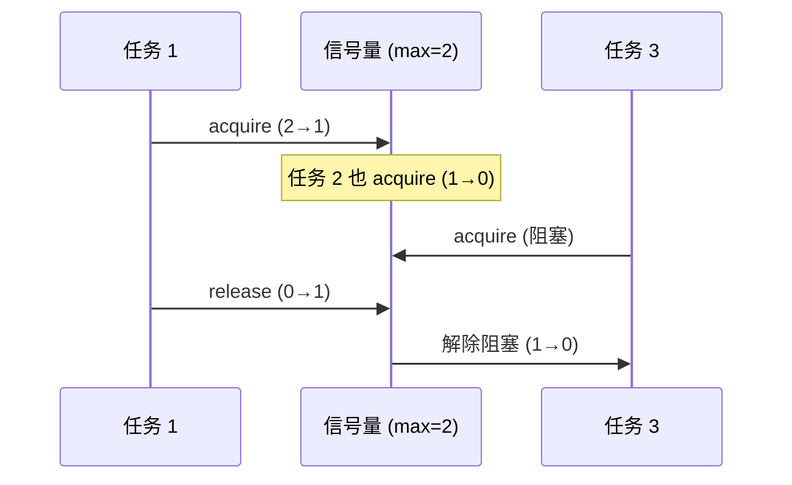

# 模式：信号量 / 有界并发 (Semaphore)

## 一句话

通过维护计数器限制并发操作数量——工作前获取，完成后释放，达到上限时阻塞。

## 核心思想

信号量是一个带两个原子操作的计数器：`acquire`（递减，为零时阻塞）和 `release`（递增）。



## 生产验证

| 项目 | 源码 | 用途 |
|------|------|------|
| Linux 内核 | [semaphore.h#L15-L55](https://github.com/torvalds/linux/blob/master/include/linux/semaphore.h#L15-L55) | `struct semaphore` — 内核计数信号量，`down()`（获取）和 `up()`（释放）。用于设备驱动访问控制。 |
| Go stdlib | [semaphore (x/sync)](https://github.com/golang/sync/blob/master/semaphore/semaphore.go) | `semaphore.Weighted` — 加权信号量。Go 惯用法也用缓冲 channel：`make(chan struct{}, n)`。 |

## 实现

::: code-group

```typescript [TypeScript]
class Semaphore {
  private queue: (() => void)[] = [];
  private count: number;
  constructor(max: number) { this.count = max; }
  async acquire(): Promise<void> {
    if (this.count > 0) { this.count--; return; }
    return new Promise<void>((resolve) => this.queue.push(resolve));
  }
  release(): void {
    const next = this.queue.shift();
    if (next) next(); else this.count++;
  }
}
```

```python [Python]
import asyncio
sem = asyncio.Semaphore(5)
async def limited_work():
    async with sem:
        await do_work()
```

:::

## 练习

| 难度 | 练习 | 文件 |
|------|------|------|
| 基础 | 实现带 acquire/release 的计数信号量 | `exercises/typescript/semaphore/01-basic.test.ts` |

## 何时使用

- **限流** — 限制并发 API 调用、数据库连接
- **资源池** — 控制对固定数量资源的访问
- **背压** — 防止压垮下游服务

## 何时不用

- **互斥** — 如果需要独占访问（max=1），用 mutex
- **简单计数** — 不需要阻塞就用原子计数器

## Also Used In

Java `Semaphore`, Python `threading.Semaphore`, Nginx worker connections, PostgreSQL `max_connections`.
