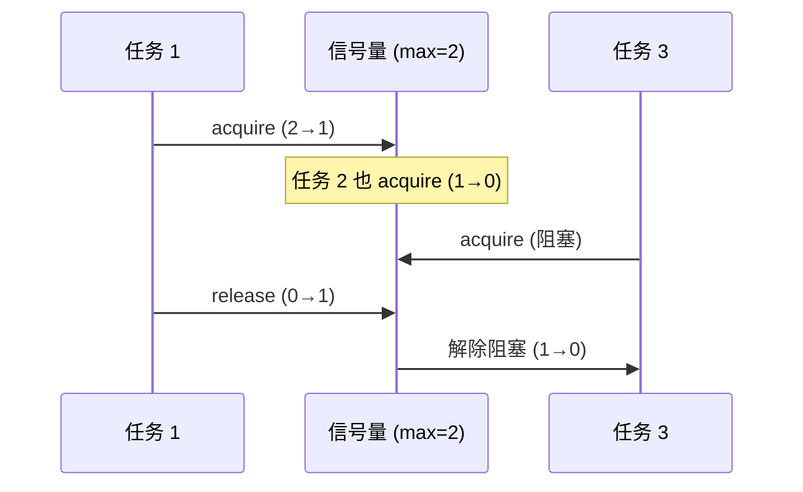

# 模式：信号量 / 有界并发 (Semaphore)

## 一句话

通过维护计数器限制并发操作数量——工作前获取，完成后释放，达到上限时阻塞。

## 核心思想

信号量是一个带两个原子操作的计数器：`acquire`（递减，为零时阻塞）和 `release`（递增）。



## 生产验证

| 项目 | 源码 | 用途 |
|------|------|------|
| Linux 内核 | [semaphore.h#L15-L55](https://github.com/torvalds/linux/blob/master/include/linux/semaphore.h#L15-L55) | `struct semaphore` — 内核计数信号量，`down()`（获取）和 `up()`（释放）。用于设备驱动访问控制。 |
| Go stdlib | [semaphore.go#L28-L107](https://github.com/golang/sync/blob/master/semaphore/semaphore.go#L28-L107) | `Weighted` 结构体（L28-L33），含 `size`、`cur`、`mu`、`waiters`。`Acquire`（L38-L107）阻塞直到信号量权重可用或上下文取消。 |

## 实现

::: code-group

```typescript [TypeScript]
class Semaphore {
  private queue: (() => void)[] = [];
  private count: number;
  constructor(max: number) { this.count = max; }
  async acquire(): Promise<void> {
    if (this.count > 0) { this.count--; return; }
    return new Promise<void>((resolve) => this.queue.push(resolve));
  }
  release(): void {
    const next = this.queue.shift();
    if (next) next(); else this.count++;
  }
}
```

```python [Python]
import asyncio
sem = asyncio.Semaphore(5)
async def limited_work():
    async with sem:
        await do_work()
```

:::

## 练习

| 难度 | 练习 | 文件 |
|------|------|------|
| 基础 | 实现带 acquire/release 的计数信号量 | `exercises/typescript/semaphore/01-basic.test.ts` |
| 进阶 | 信号量守护的连接池 | `exercises/typescript/semaphore/02-intermediate.test.ts` |

## 何时使用

- **限流** — 限制并发 API 调用、数据库连接
- **资源池** — 控制对固定数量资源的访问
- **背压** — 防止压垮下游服务

## 何时不用

- **互斥** — 如果需要独占访问（max=1），用 mutex
- **简单计数** — 不需要阻塞就用原子计数器

## 更多生产案例

- Java `Semaphore`
- Python `threading.Semaphore`
- [Nginx](https://github.com/nginx/nginx) — worker connections
- [PostgreSQL](https://github.com/postgres/postgres) — `max_connections`

## 挑战题

::: details Q1: A semaphore with max=1 behaves like a mutex. Why would you ever use a mutex instead of a semaphore(1)?
**Answer:** A mutex has ownership semantics — only the thread that acquired it can release it — which prevents accidental release by another thread and enables priority inheritance.

A semaphore is an anonymous counter: any thread can call `release()` regardless of who called `acquire()`. This means a bug where thread B accidentally releases thread A's semaphore goes undetected. A mutex tracks its owner, so an unlock by a non-owner is an error (or panic). Additionally, mutex ownership enables priority inheritance: if a high-priority thread is waiting for a mutex held by a low-priority thread, the OS can temporarily boost the holder's priority. Semaphores can't do this because there's no "holder."
:::

::: details Q2: Three high-priority tasks and one low-priority task share a semaphore(1). The low-priority task acquires the semaphore, then a medium-priority task preempts it. The high-priority tasks are now blocked. What is this called and how is it solved?
**Answer:** This is priority inversion — a high-priority task is indirectly blocked by a medium-priority task that preempts the low-priority lock holder.

The classic example is the Mars Pathfinder bug. The medium-priority task runs indefinitely because it doesn't need the semaphore, preventing the low-priority task from finishing and releasing the semaphore. Solutions: (1) priority inheritance — temporarily boost the lock holder to the highest waiter's priority, (2) priority ceiling — assign the semaphore a ceiling priority equal to the highest-priority task that uses it, (3) avoid holding semaphores across preemption points.
:::

::: details Q3: You use a semaphore(10) to limit concurrent database connections. Under load, you discover connections are being created and destroyed rapidly. What is wrong with this design?
**Answer:** A semaphore only limits concurrency, not reuse. You need a connection pool (object pool pattern) combined with a semaphore, not a semaphore alone.

A semaphore permits up to 10 tasks to proceed but doesn't manage the connections themselves. Each task creates a new connection, uses it, and destroys it — the semaphore just gates how many do this simultaneously. A connection pool holds 10 pre-created connections and lends them out. The pool internally uses a semaphore (or equivalent blocking mechanism) to make callers wait when all connections are checked out. The semaphore is the concurrency primitive; the pool is the resource manager.
:::

::: details Q4: Go uses a buffered channel as a semaphore (`sem := make(chan struct{}, N)`). What advantage does this have over a traditional semaphore implementation?
**Answer:** It composes naturally with Go's `select` statement, enabling timeout, cancellation, and multi-resource acquisition without additional APIs.

With a channel-based semaphore, you can write `select { case sem <- struct{}{}: /* acquired */ case <-ctx.Done(): /* cancelled */ }` — combining acquisition with context cancellation in one construct. A traditional semaphore needs a separate `TryAcquire` or `AcquireWithTimeout` method. The channel approach also benefits from Go's runtime scheduler: goroutines blocked on channel operations are parked efficiently without consuming OS threads. The tradeoff is that channels have slightly higher overhead than a mutex-based counter for simple cases.
:::
