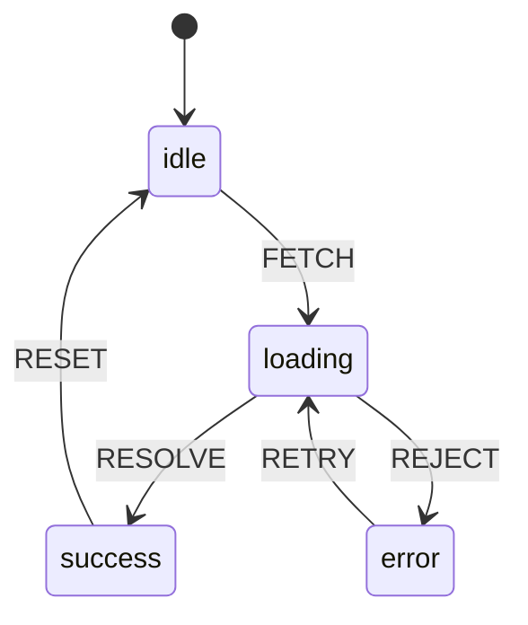

# 模式：状态机 (State Machine)

## 一句话

将实体的生命周期建模为一组状态和显式转换，让不可能的状态不可表达，每次状态变更可审计。

## 核心思想

状态机定义实体可能处于的有限状态集，以及状态之间的转换。任何时刻，实体恰好处于一个状态。转换由事件触发。



威力所在：**不存在的转换不可能发生**。你无法从 `success` 跳到 `error`，因为没有定义这样的转换。

## 生产验证

| 项目 | 源码 | 用途 |
|------|------|------|
| XState | [StateMachine.ts#L58-L120](https://github.com/statelyai/xstate/blob/main/packages/core/src/StateMachine.ts#L58-L120) | JavaScript/TypeScript 工业级状态机库。Netflix、Microsoft、AWS 在复杂 UI 流程和工作流中使用。 |
| Linux 内核 | [tcp_input.c#L4865-L4920](https://github.com/torvalds/linux/blob/master/net/ipv4/tcp_input.c#L4865-L4920) | TCP 连接状态机——`switch (sk->sk_state)` 实现了每个互联网连接使用的 TCP 状态转换。 |

## 实现

::: code-group

```typescript [TypeScript]
type StateConfig = Record<string, { on: Record<string, string> }>;

class StateMachine {
  private current: string;
  constructor(private config: StateConfig, initial: string) {
    this.current = initial;
  }
  get state(): string { return this.current; }
  send(event: string): string {
    const next = this.config[this.current]?.on[event];
    if (next !== undefined) this.current = next;
    return this.current;
  }
  can(event: string): boolean {
    return this.config[this.current]?.on[event] !== undefined;
  }
}
```

```python [Python]
class StateMachine:
    def __init__(self, config, initial):
        self._config = config
        self._current = initial

    @property
    def state(self): return self._current

    def send(self, event):
        transitions = self._config.get(self._current, {}).get("on", {})
        if event in transitions:
            self._current = transitions[event]
        return self._current

# 用法：交通灯
light = StateMachine({
    "green":  {"on": {"TIMER": "yellow"}},
    "yellow": {"on": {"TIMER": "red"}},
    "red":    {"on": {"TIMER": "green"}},
}, initial="green")
light.send("TIMER")  # "yellow"
```

:::

## 练习

| 难度 | 练习 | 文件 |
|------|------|------|
| 基础 | 实现带 send/can 的状态机 | `exercises/typescript/state-machine/01-basic.test.ts` |

## 何时使用

- **协议实现** — TCP、HTTP、WebSocket 状态转换
- **UI 流程管理** — 多步表单、认证流程、模态框
- **游戏逻辑** — 角色状态（待机、行走、攻击、死亡）
- **工作流引擎** — 审批链、部署流水线

## 何时不用

- **简单布尔切换** — `true`/`false` 不需要状态机
- **无界状态** — 连续状态空间（位置、分数）用普通变量
- **无非法转换** — 如果任何状态可以转到任何其他状态，不需要约束
