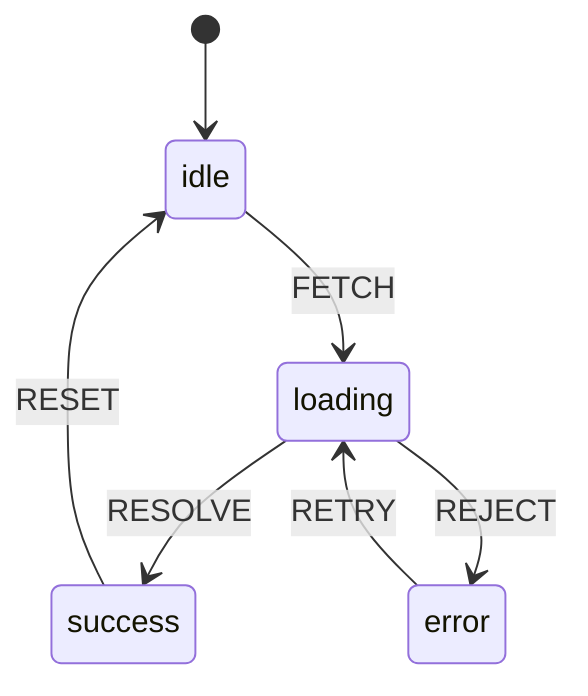

# 模式：状态机 (State Machine)

## 一句话

将实体的生命周期建模为一组状态和显式转换，让不可能的状态不可表达，每次状态变更可审计。

## 核心思想

状态机定义实体可能处于的有限状态集，以及状态之间的转换。任何时刻，实体恰好处于一个状态。转换由事件触发。



威力所在：**不存在的转换不可能发生**。你无法从 `success` 跳到 `error`，因为没有定义这样的转换。

**动手试试** — 点击事件按钮触发状态转换，观察每个状态下哪些事件有效：

<StateMachineViz />

## 生产验证

| 项目 | 源码 | 用途 |
|------|------|------|
| XState | [StateMachine.ts#L58-L120](https://github.com/statelyai/xstate/blob/main/packages/core/src/StateMachine.ts#L58-L120) | JavaScript/TypeScript 工业级状态机库。Netflix、Microsoft、AWS 在复杂 UI 流程和工作流中使用。 |
| Linux 内核 | [tcp_input.c#L4865-L4920](https://github.com/torvalds/linux/blob/master/net/ipv4/tcp_input.c#L4865-L4920) | TCP 连接状态机——`switch (sk->sk_state)` 实现了每个互联网连接使用的 TCP 状态转换。 |

## 实现

::: code-group

```typescript [TypeScript]
type StateConfig = Record<string, { on: Record<string, string> }>;

class StateMachine {
  private current: string;
  constructor(private config: StateConfig, initial: string) {
    this.current = initial;
  }
  get state(): string { return this.current; }
  send(event: string): string {
    const next = this.config[this.current]?.on[event];
    if (next !== undefined) this.current = next;
    return this.current;
  }
  can(event: string): boolean {
    return this.config[this.current]?.on[event] !== undefined;
  }
}
```

```python [Python]
class StateMachine:
    def __init__(self, config, initial):
        self._config = config
        self._current = initial

    @property
    def state(self): return self._current

    def send(self, event):
        transitions = self._config.get(self._current, {}).get("on", {})
        if event in transitions:
            self._current = transitions[event]
        return self._current

# 用法：交通灯
light = StateMachine({
    "green":  {"on": {"TIMER": "yellow"}},
    "yellow": {"on": {"TIMER": "red"}},
    "red":    {"on": {"TIMER": "green"}},
}, initial="green")
light.send("TIMER")  # "yellow"
```


```rust [Rust]
use std::collections::HashMap;

pub struct StateMachine {
    current: String,
    transitions: HashMap<(String, String), String>,
}

impl StateMachine {
    pub fn new(initial: &str) -> Self {
        StateMachine {
            current: initial.to_string(),
            transitions: HashMap::new(),
        }
    }

    pub fn add_transition(&mut self, from: &str, event: &str, to: &str) {
        self.transitions.insert(
            (from.to_string(), event.to_string()),
            to.to_string(),
        );
    }

    pub fn send(&mut self, event: &str) -> &str {
        let key = (self.current.clone(), event.to_string());
        if let Some(next) = self.transitions.get(&key) {
            self.current = next.clone();
        }
        &self.current
    }

    pub fn state(&self) -> &str {
        &self.current
    }
}
```

```go [Go]
type StateMachine struct {
	current     string
	transitions map[string]map[string]string // state -> event -> next
}

func New(initial string) *StateMachine {
	return &StateMachine{
		current:     initial,
		transitions: make(map[string]map[string]string),
	}
}

func (sm *StateMachine) AddTransition(from, event, to string) {
	if sm.transitions[from] == nil {
		sm.transitions[from] = make(map[string]string)
	}
	sm.transitions[from][event] = to
}

func (sm *StateMachine) Send(event string) string {
	if next, ok := sm.transitions[sm.current][event]; ok {
		sm.current = next
	}
	return sm.current
}

func (sm *StateMachine) State() string { return sm.current }
```
:::

## 练习

| 难度 | 练习 | 文件 |
|------|------|------|
| 基础 | 实现带 send/can 的状态机 | `exercises/typescript/state-machine/01-basic.test.ts` |
| 进阶 | 带定时转换的交通灯控制器 | `exercises/typescript/state-machine/02-intermediate.test.ts` |

运行练习：`pnpm test`

## 何时使用

- **协议实现** — TCP、HTTP、WebSocket 状态转换
- **UI 流程管理** — 多步表单、认证流程、模态框
- **游戏逻辑** — 角色状态（待机、行走、攻击、死亡）
- **工作流引擎** — 审批链、部署流水线

## 何时不用

- **简单布尔切换** — `true`/`false` 不需要状态机
- **无界状态** — 连续状态空间（位置、分数）用普通变量
- **无非法转换** — 如果任何状态可以转到任何其他状态，不需要约束

## 更多生产案例

- Regex engines (NFA/DFA)
- HTTP/2 stream states ([RFC 7540](https://datatracker.ietf.org/doc/html/rfc7540))
- [Kubernetes](https://github.com/kubernetes/kubernetes) — pod lifecycle
- Game AI (behavior trees + FSM)

## 相关模式

| 模式 | 关系 |
|---------|-------------|
| [Actor 模型](/zh/patterns/actor-model/) | Actor 通常使用状态机管理其内部行为 |
| [熔断器 (Circuit Breaker)](/zh/patterns/circuit-breaker/) | 熔断器是经典的状态机：关闭 -> 打开 -> 半开 |
| [访问者 / 树遍历器 (Visitor / Tree Walker)](/zh/patterns/visitor/) | 访问者可以根据状态机的当前状态进行不同的分发 |

## 挑战题

::: details Q1: 一个表单有 4 个步骤，每个步骤有"有效"和"无效"子状态，加上"提交中"和"已提交"状态。就是 4*2 + 2 = 10 个状态。如果你添加"脏/干净"维度，翻倍到 20。如何避免这种状态爆炸？
**答案：** 使用并行（正交）状态机——一个管表单步骤，一个管验证状态，一个管脏标记——而不是用一个扁平状态机包含所有组合。

这正是状态图（Harel 对 FSM 的扩展）解决的问题。每个关注点作为独立区域运行：步骤机处理 `NEXT`/`BACK`，验证机处理 `VALIDATE`/`INVALIDATE`，脏标记机处理 `CHANGE`/`SAVE`。它们组合而不是相乘。XState 通过 `type: 'parallel'` 支持这一点。总状态数是 4 + 2 + 2 = 8，而不是 4 x 2 x 2 = 16。
:::

::: details Q2: 在交通灯示例中，你希望红灯保持 60 秒但黄灯只有 5 秒。这个定时逻辑应该在状态机内部还是外部？
**答案：** 定时逻辑在状态机外部作为事件源；状态机只定义哪些转换是有效的。

状态机不是调度器——它定义*什么*可以发生，而非*何时*发生。外部定时器在适当的延迟后触发 `TIMER` 事件。状态机接收事件并转换。这种分离很重要：无论定时器是真实的（生产）、即时的（测试）还是手动的（调试），同样的状态机定义都能工作。将延迟放在转换内部会将状态机耦合到时间，使其更难测试和推理。
:::

::: details Q3: 你添加了一个守卫条件："只有当响应状态码为 200 时才从 `loading` 转换到 `success`。"如果没有守卫匹配会怎样——事件是否被静默丢弃？
**答案：** 是的，在大多数实现中事件被静默忽略，状态机保持在当前状态。

这是设计如此——在状态机语义中，未处理的事件不是错误。如果没有转换匹配（因为没有守卫通过），状态机保持稳定。这比抛出异常更安全，因为事件通常是异步到达的，可能与当前状态无关。如果你需要显式处理"没有转换匹配"的情况，将其建模为到错误状态的兜底转换，或使用 `onEvent` 钩子记录未处理的事件。
:::

::: details Q4: TCP 有 11 个状态和约 25 个转换。你能用一系列 `if/else` 检查布尔标志如 `isConnected`、`isSynSent`、`isFinWait` 来替代状态机吗？
**答案：** 技术上可以，但你失去了"不可能的状态不可表示"的保证——布尔标志允许 `isConnected && isFinWait` 这样的无效组合。

11 个布尔值有 2^11 = 2048 种可能的组合，其中只有 11 种是有效的。每个 `if/else` 都必须防范那 2037 种无效状态。状态机通过构造使这不可能：实体始终恰好在一个状态中，只有定义的转换才能改变它。TCP 规范本身就是用状态图定义的，而不是布尔逻辑，因为状态机表示是可证明正确的，而布尔方法是可证明脆弱的。
:::
