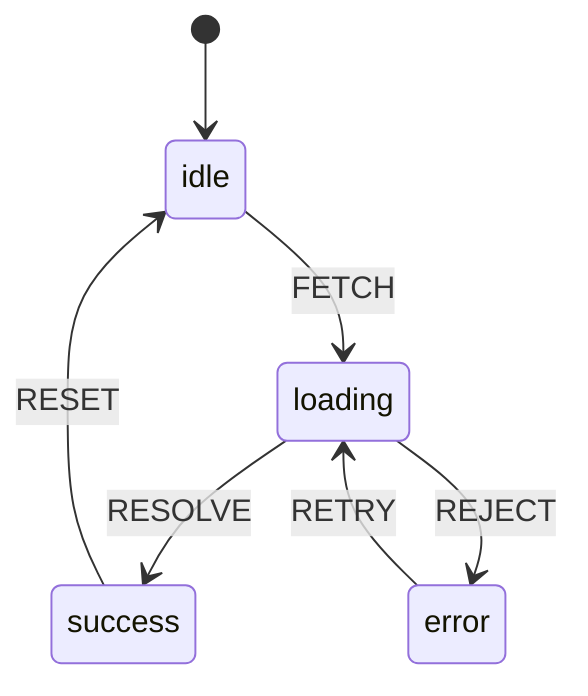

# 模式：状态机 (State Machine)

## 一句话

将实体的生命周期建模为一组状态和显式转换，让不可能的状态不可表达，每次状态变更可审计。

## 核心思想

状态机定义实体可能处于的有限状态集，以及状态之间的转换。任何时刻，实体恰好处于一个状态。转换由事件触发。



威力所在：**不存在的转换不可能发生**。你无法从 `success` 跳到 `error`，因为没有定义这样的转换。

## 生产验证

| 项目 | 源码 | 用途 |
|------|------|------|
| XState | [StateMachine.ts#L58-L120](https://github.com/statelyai/xstate/blob/main/packages/core/src/StateMachine.ts#L58-L120) | JavaScript/TypeScript 工业级状态机库。Netflix、Microsoft、AWS 在复杂 UI 流程和工作流中使用。 |
| Linux 内核 | [tcp_input.c#L4865-L4920](https://github.com/torvalds/linux/blob/master/net/ipv4/tcp_input.c#L4865-L4920) | TCP 连接状态机——`switch (sk->sk_state)` 实现了每个互联网连接使用的 TCP 状态转换。 |

## 实现

::: code-group

```typescript [TypeScript]
type StateConfig = Record<string, { on: Record<string, string> }>;

class StateMachine {
  private current: string;
  constructor(private config: StateConfig, initial: string) {
    this.current = initial;
  }
  get state(): string { return this.current; }
  send(event: string): string {
    const next = this.config[this.current]?.on[event];
    if (next !== undefined) this.current = next;
    return this.current;
  }
  can(event: string): boolean {
    return this.config[this.current]?.on[event] !== undefined;
  }
}
```

```python [Python]
class StateMachine:
    def __init__(self, config, initial):
        self._config = config
        self._current = initial

    @property
    def state(self): return self._current

    def send(self, event):
        transitions = self._config.get(self._current, {}).get("on", {})
        if event in transitions:
            self._current = transitions[event]
        return self._current

# 用法：交通灯
light = StateMachine({
    "green":  {"on": {"TIMER": "yellow"}},
    "yellow": {"on": {"TIMER": "red"}},
    "red":    {"on": {"TIMER": "green"}},
}, initial="green")
light.send("TIMER")  # "yellow"
```

:::

## 练习

| 难度 | 练习 | 文件 |
|------|------|------|
| 基础 | 实现带 send/can 的状态机 | `exercises/typescript/state-machine/01-basic.test.ts` |
| 进阶 | 带定时转换的交通灯控制器 | `exercises/typescript/state-machine/02-intermediate.test.ts` |

## 何时使用

- **协议实现** — TCP、HTTP、WebSocket 状态转换
- **UI 流程管理** — 多步表单、认证流程、模态框
- **游戏逻辑** — 角色状态（待机、行走、攻击、死亡）
- **工作流引擎** — 审批链、部署流水线

## 何时不用

- **简单布尔切换** — `true`/`false` 不需要状态机
- **无界状态** — 连续状态空间（位置、分数）用普通变量
- **无非法转换** — 如果任何状态可以转到任何其他状态，不需要约束

## 更多生产案例

- Regex engines (NFA/DFA)
- HTTP/2 stream states ([RFC 7540](https://datatracker.ietf.org/doc/html/rfc7540))
- [Kubernetes](https://github.com/kubernetes/kubernetes) — pod lifecycle
- Game AI (behavior trees + FSM)

## 挑战题

::: details Q1: A form has 4 steps, each with a "valid" and "invalid" sub-state, plus a "submitting" and "submitted" state. That's 4*2 + 2 = 10 states. If you add a "dirty/clean" dimension, it doubles to 20. How do you avoid this state explosion?
**Answer:** Use parallel (orthogonal) state machines — one for the form step, one for validation status, one for dirty tracking — instead of one flat machine with every combination.

This is exactly what statecharts (Harel's extension of FSMs) solve. Each concern runs as an independent region: the step machine handles `NEXT`/`BACK`, the validation machine handles `VALIDATE`/`INVALIDATE`, the dirty machine handles `CHANGE`/`SAVE`. They compose without multiplying. XState supports this via `type: 'parallel'`. The total states are 4 + 2 + 2 = 8 instead of 4 × 2 × 2 = 16.
:::

::: details Q2: In the traffic light example, you want the light to stay red for 60s but yellow for only 5s. Where does this timing logic belong — in the state machine or outside it?
**Answer:** The timing lives outside the machine as the event source; the machine only defines which transitions are valid.

A state machine is not a scheduler — it defines *what* can happen, not *when*. An external timer fires a `TIMER` event after the appropriate delay. The machine receives the event and transitions. This separation is important: the same machine definition works whether timers are real (production), instant (tests), or manual (debugging). Putting delays inside transitions couples the machine to time, making it harder to test and reason about.
:::

::: details Q3: You add a guard condition: "only transition from `loading` to `success` if the response has status 200." What happens if no guard matches — is the event silently dropped?
**Answer:** Yes, in most implementations the event is silently ignored and the machine stays in its current state.

This is by design — an unhandled event is not an error in state machine semantics. If no transition matches (because no guard passes), the machine remains stable. This is safer than throwing an exception, because events often arrive asynchronously and may be irrelevant to the current state. If you need to handle "no transition matched" explicitly, model it as a catch-all transition to an error state, or use an `onEvent` hook to log unhandled events.
:::

::: details Q4: TCP has 11 states and ~25 transitions. Could you replace the state machine with a series of `if/else` checks on boolean flags like `isConnected`, `isSynSent`, `isFinWait`?
**Answer:** Technically yes, but you lose the guarantee that impossible states are unrepresentable — boolean flags allow invalid combinations like `isConnected && isFinWait`.

With 11 booleans you have 2^11 = 2048 possible combinations, of which only 11 are valid. Every `if/else` must guard against the 2037 invalid states. A state machine makes this impossible by construction: the entity is always in exactly one state, and only defined transitions can change it. The TCP spec itself is defined as a state diagram, not as boolean logic, because the state machine representation is provably correct while the boolean approach is provably fragile.
:::
